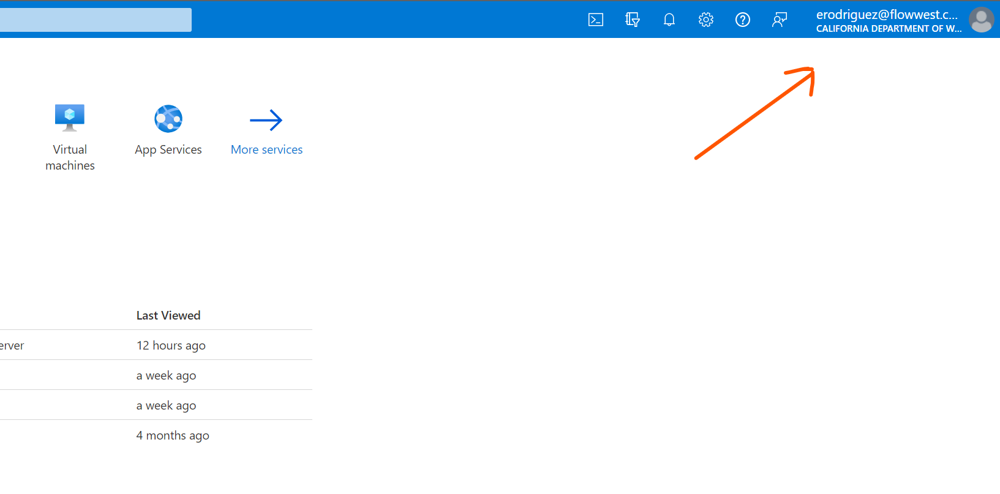

```{r, include = FALSE}
knitr::opts_chunk$set(
  collapse = TRUE,
  comment = "#>"
)
```

```{r setup}
library(grunID)
```


## Confirm Account on Azure

The first step in the process is to confirm that your account has been successfully linked to Azure. To do this, navigate to the <a href="https://portal.azure.com/" target="_blank">Microsoft Azure Portal</a> and log in with your existing credentials or create a new one. Once logged in, click on your account as shown below.

{width=75%}

Next click on **Switch Directory**

{width=50%}

and confirm you have a directory for the California Department of Water Resources. If you are not already switched to this directory do so now. If you do not see this directory contact Emanuel Rodriguez at [erodriguez@flowwest.com](mailto:erodriguez@flowwest.com) for help.

{width=100%}

## Install Depedencies 

In addition to installing the R package, we need to install the Azure Command Line Interface (CLI) to authenticate through Azure Directory. The Azure CLI allows us to link a local R session with your Azure AD account and authenticate a user with read/write permissions to the database using a "token". An overview of the tool can be found at <a href="https://learn.microsoft.com/en-us/cli/azure/" target="_blank">https://learn.microsoft.com/en-us/cli/azure/</a>. To download and install the tool, visit the <a href="https://learn.microsoft.com/en-us/cli/azure/install-azure-cli-windows?tabs=azure-cli" target="_blank">Install Azure CLI on Windows</a> page, or for Mac OS visit the <a href="https://learn.microsoft.com/en-us/cli/azure/install-azure-cli-macos" target="_blank">Install for Mac OS</a> page.


## Authentication with AZ tool

The next step requires opening a command prompt. On Windows, this can be done by searching for "command prompt" in the Start menu, or by right-clicking the Start button and selecting "Windows PowerShell" or "Windows Command prompt" from the pop-up menu. On Mac, you should use the "Terminal" application. The Windows Command Prompt is shown below.


Next, we'll want to log in to Azure from the command line. To do this, simply enter the following at the command prompt. After pressing enter, an internet browser will open where you can log into your Azure account. If you have already logged in on the previous step, this will simply allow you to select an account to use.

```
az login
```


## Create Connection

The `grunID` package comes with a function `gr_db_connect` that will create an authentication token for you and pass it down as your password to the appropriate `DBI::dbConnect` function. All you will need to provide at this point is either a `config.yml` or your username and host to the `gr_db_connect` function. An example of both of these is shown below.


### Authentication with Config file

The easiest and safest way to manage your connection to the database is using a `config.yml` file. The `grundID` package uses the `config` R package to parse the contents of the file and populate an appropriate connection string. The format of the config file is shown below. 

**Note**:

- The name of the file must be **config.yml** and be within your working directory. 

- If using source control please be sure to add `config.yml` to your ignores file.

```yaml
default:
  dbname: <db-name will be provided>
  username: <your-username will be provided>
  port: 5432
  host: <db-host will be provided>
```

All characters between `<>` (including the `<>`) are to be replaced with values provided by the database administrator. 

**Note**:

- The password is left out of the file, as it is filled in by using the `az` tool installed in the previous step.

With this file in place, we create a connection to the database with the following:

```r
con <- gr_db_connect() # a config file will be searched for starting at the working directory.

dplyr::tbl(con, "agency")
```


### Authentication with username, dbname and host

The `gr_db_connect` function can also be called with arguments specifying your username, database name and host for the server for the database. Note that this is a quick way to create a connection to the database but if using source control its also an easy way to accidentally share your credentials. For this reason, we recommend setting up a config file and adding it to your ignores file.

```r
con <- gr_db_connect(
  username = "myusername", 
  dbname = "dbname", 
  host = "host.com"
)

dplyr::tbl(con, "agency")
```

```
     id code    agency_name active created_at          creat…¹ updated_at          updat…²
  <int> <chr>   <chr>       <lgl>  <dttm>              <chr>   <dttm>              <chr>  
1     1 DWR     Department… TRUE   2023-01-12 01:54:44 runida… 2023-01-12 01:54:44 runida…
2     2 CDFW    California… TRUE   2023-01-12 01:54:44 runida… 2023-01-12 01:54:44 runida…
3     3 USFWS   United Sta… TRUE   2023-01-12 01:54:44 runida… 2023-01-12 01:54:44 runida…
4     4 UCDAVIS University… TRUE   2023-01-12 01:54:44 runida… 2023-01-12 01:54:44 runida…
# … with abbreviated variable names created_by, updated_by

```
