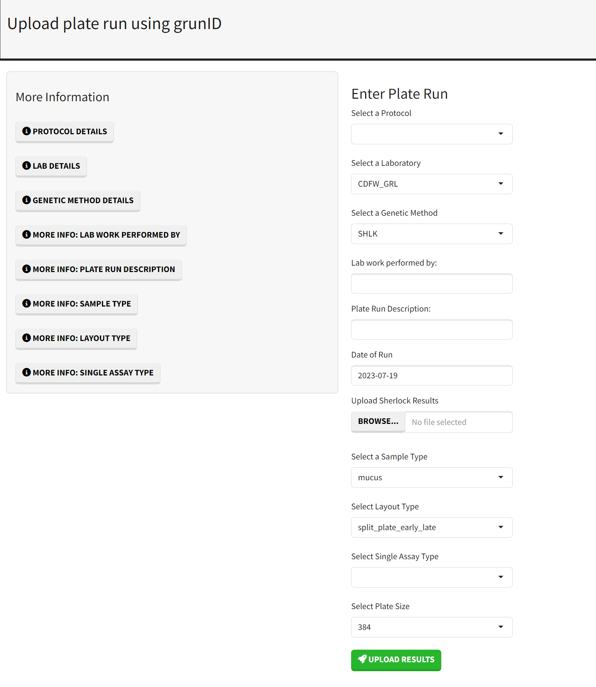

```{r, include = FALSE}
knitr::opts_chunk$set(
  collapse = TRUE,
  comment = "#>"
)
```

```{r setup}
library(grunID)
```

# Introduction

Starting from version 0.5 of `grunID`, an R Shiny app is included in the package. To launch the app, simply call the function `grunID::run_app()`. Like `grunID::gr_db_connect()`, the app will search for a configuration file to obtain the necessary parameters for connecting to the database. In this guide, we will explore the various features of the app and provide instructions on how to use it.

*Note: The app is currently in development, and changes may be made. As a result, this documentation may not always be up-to-date. Please report any bugs to erodriguez@flowwest.com.*

# Usage

To launch the app, run `grunID::run_app()`. You can optionally pass in a path to a config file, but by 
default, the app will search for a config file within the working directory.

```r
grunID::run_app()
```


